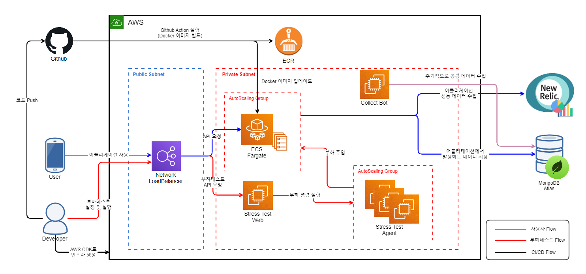
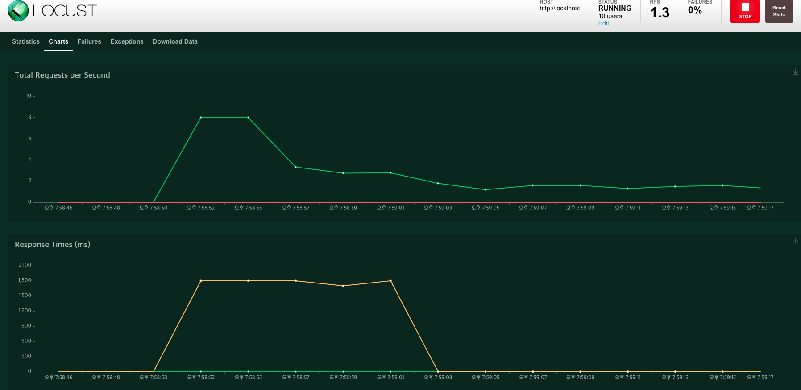

## nomad-cafe-subsystem
노마드 카페 서버 구동 시 필요한 서브시스템

### 전체 아키텍처



### 사용자 Flow

- 사용자는 모바일 Nomad Cafe 사이트에 접속하여 기능을 실행하면 각 요청이 Network LoadBalancer를 거쳐 Nomad Cafe 웹 서버로 API 요청이 전달된다. 이 때 Nomad Cafe 웹서버는 ECS Fargate를 사용하여 실행되기 때문에 트래픽 증가에 따라 컨테이너 수가 스케일 인/아웃 된다. 
- 사용자가 웹 사이트를 이용하면서 발생하는 데이터들은 모두 MongoDB에 저장되며 MongoDB는 관리형 서비스인 Atlas를 사용한다. 
  

- 웹 서버 어플리케이션에는 New Relic Agent가 탑재되어 어플리케이션에서 발생하는 성능 지표들이 New Relic 서버로 전송된다. 수집된 데이터들은 New Relic Dashboard를 사용하여 어플리케이션의 이상 유무 및 성능을 확인할 수 있다.
  

### CI/CD Flow

- 웹 서버는 Amazon ECS Fargate를 사용하고 있기 떄문에 Docker 이미지가 ECR로 푸시되면 ECS의 Task Definition 수정으로 이미지 버전을 갱신하고, Service Update를 수행함으로써 안전하게 배포 된다.   
- Github Action에서 실행되는 절차는 다음과 같다.
    1. Github Repository에 코드 Push
    2. Github Action을 사용하여 Docker 이미지 빌드
    3. Amazon ECR로 Docker 이미지 Push
    4. 최신 Task Definition의 json 파일 다운로드
    5. Task Definition에 Docker 이미지 버전 갱신
    6. 갱신된 Task Definition을 기반으로 Service 업데이트
    7. master 브랜치인 경우 릴리즈 생성

### 부하테스트 Flow


- 개발 진행 중 웹 서버의 안정성을 위해 정기적으로 부하테스트를 진행한다. 부하 테스트는 AWS CDK를 사용하여 필요한 시점에 생성하여 테스트를 진행하고, 종료 시 제거한다.
- 부하테스트 시에는 Python으로 시나리오 작성이 가능한 Locust를 사용한다. Locust는 부하테스트 설정 및 실행, 모니터링을 위한 웹서버와 실제 부하를 일으키는 에이전트로 구성된다.


### 버전 정보

- python : 3.8.x
- certifi	: 2020.6.20
- chardet	: 3.0.4
- configparser : 	5.0.0
- dnspython	: 2.0.0
- idna	: 2.10
- pip	: 20.2
- pymongo	: 3.10.1
- requests : 2.24.0
- setuptools : 	49.2.0
- urllib3 : 1.25.10

### mongodb 설정
mongo Atlas 연결을 위해서는 mongo+srv scheme을 사용한다. 이로 인해 dnspython 모듈 설치가 필요하다.
```
pip3 install dnspython
```
dnspython 1.15버전에서는 mongodb 접속 시 아래와 같은 오류가 발생하므로 1.16 이상 버전으로 설치해야한다.
```
pymongo.errors.ConfigurationError: query() got an unexpected keyword argument 'lifetime'
```
주변 지역 탐색 쿼리를 위해 아래 명령으로 인덱스를 활성화해야함
```
db.cafe.ensureIndex({location:"2dsphere"})
```

### 로컬에서 데이터베이스 접속 (on Windows)
1. mongo Shell Download
    ```
    https://downloads.mongodb.org/win32/mongodb-shell-win32-x86_64-2012plus-4.2.8.zip
    ```
2. mongo Shell에서 연결
    ```
    mongo "mongodb+srv://nomad-cafe.kgqub.mongodb.net/<dbname>" --username <username>
    ```
    - dbname : nomad-cafe
    - username : nomad-cafe
    
### AWS CDK로 프로비저닝
1. cdk 경로로 이동
    ```buildoutcfg
    cd aws_cdk
    ```
2. setup
    ```buildoutcfg
    python3 setup.py install
    ```
3. cdk 실행
    ```buildoutcfg
    cdk deploy VpcCdkStack WebCdkStack StressTestCdkStack SgCdkStack
    ```
4. cdk 제거
    ```buildoutcfg
    cdk destroy VpcCdkStack WebCdkStack StressTestCdkStack SgCdkStack
    ```