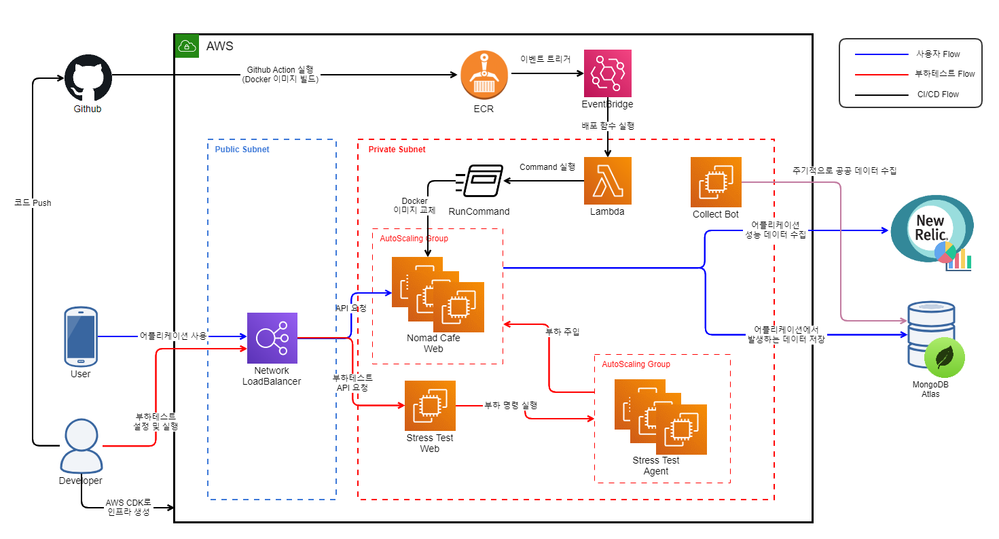
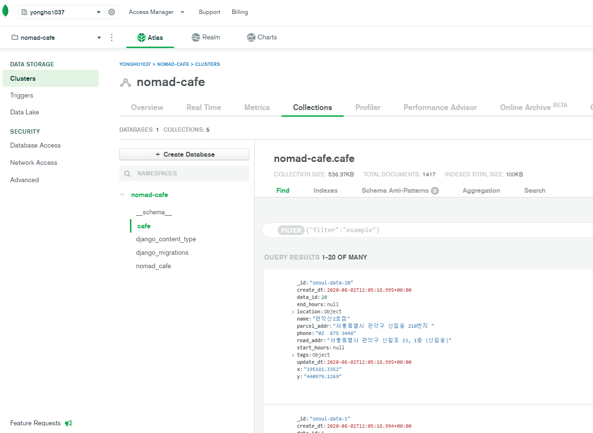
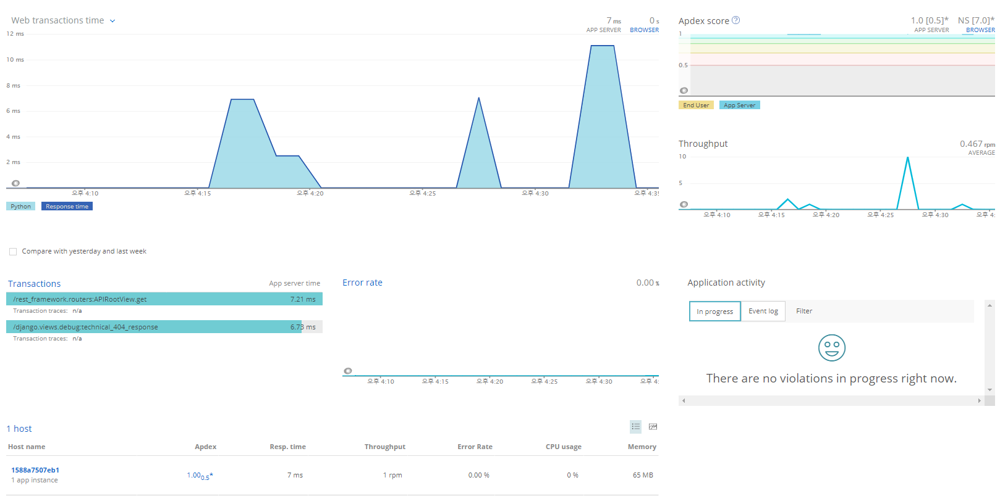

## nomad-cafe-subsystem
노마드 카페 서버 구동 시 필요한 서브시스템

### 전체 아키텍처



### 사용자 Flow

- 사용자는 모바일 Nomad Cafe 사이트에 접속하여 기능을 실행하면 각 요청이 Network LoadBalancer를 거쳐 Nomad Cafe 웹 서버로 API 요청이 전달된다. 이 때 Nomad Cafe 웹서버는 오토스케일링 그룹에 등록되어 트래픽이 증가하거나 감소할 경우 스케일 인/아웃을 수행한다.
- 사용자가 웹 사이트를 이용하면서 발생하는 데이터들은 모두 MongoDB에 저장되며 MongoDB는 관리형 서비스인 Atlas를 사용한다. 
  

- 웹 서버 어플리케이션에는 New Relic Agent가 탑재되어 어플리케이션에서 발생하는 성능 지표들이 New Relic 서버로 전송된다. 수집된 데이터들은 New Relic Dashboard를 사용하여 어플리케이션의 이상 유무 및 성능을 확인할 수 있다.
  

### CI/CD Flow

- 배포 자동화를 위해서는 외부에서 대상 EC2 인스턴스로 SSH 접속이 가능해야 하지만 웹 서버가 실행되고 있는 EC2 인스턴스는 외부 접근이 불가능한 Private 서브넷에 생성되어있다. 
- Github Action으로 배포 할 경우 Github Action 스크립트가 실행되는 Github 쪽 서버의 ACL이 허용되어 있어야 하지만 Github Action이 실행되는 서버는 불특정 다수의 Ip를 사용하기 때문에 광범위한 ACL 허용이 필요하다.
- 이와 같은 이유로 ECR로 이미지만 push되면 해당 이벤트에 의해 Github과는 별개로 배포가 진행되도록 구성한다. AWS EventBridge를 사용하면 ECR로 이미지가 Push된 이벤트를 감지하여 Lambda 함수를 실행할 수 있다. 
- Lambda 함수가 실행되더라도 EC2 인스턴스의 Docker 이미지를 갱신하기 위해서는 결국 해당 인스턴스에 SSH로 접근하여 명령을 실행해야 한다. SSH 설정의 번거로움을 줄이기 위해 AWS System Manager의 RunCommand 기능을 사용하여 대상 EC2 인스턴스에 Shell Script를 실행한다.
- 결과적으로 외부에서 발생한 이벤트로 별도의 ACL 허용 없이 Private Subnet에 위치한 EC2 인스턴스의 Docker 이미지 교체가 가능하다. 
- 요약하면 다음과 같다.
    1. Github Repository에 코드 Push
    2. Github Action을 사용하여 Docker 이미지 빌드
    3. Amazon ECR로 Docker 이미지 Push
    4. 이미지가 Push 되면 EventBridge에서 감지
    5. EventBridge에서 Lambda 함수 실행
    6. Lambda 함수에서 System Manager Runcommand 실행
    7. 배포 대상 EC2 인스턴스에서 미리 작성해둔 스크립트가 실행되어 Docker 이미지 갱신

### 부하테스트 Flow

개발 진행 중 웹 서버의 안정성을 위해 

### 버전 정보

- python : 3.8.x
- certifi	: 2020.6.20
- chardet	: 3.0.4
- configparser : 	5.0.0
- dnspython	: 2.0.0
- idna	: 2.10
- pip	: 20.2
- pymongo	: 3.10.1
- requests : 2.24.0
- setuptools : 	49.2.0
- urllib3 : 1.25.10

### mongodb 설정
mongo Atlas 연결을 위해서는 mongo+srv scheme을 사용한다. 이로 인해 dnspython 모듈 설치가 필요하다.
```
pip3 install dnspython
```
dnspython 1.15버전에서는 mongodb 접속 시 아래와 같은 오류가 발생하므로 1.16 이상 버전으로 설치해야한다.
```
pymongo.errors.ConfigurationError: query() got an unexpected keyword argument 'lifetime'
```
주변 지역 탐색 쿼리를 위해 아래 명령으로 인덱스를 활성화해야함
```
db.cafe.ensureIndex({location:"2dsphere"})
```

### 로컬에서 데이터베이스 접속 (on Windows)
1. mongo Shell Download
    ```
    https://downloads.mongodb.org/win32/mongodb-shell-win32-x86_64-2012plus-4.2.8.zip
    ```
2. mongo Shell에서 연결
    ```
    mongo "mongodb+srv://nomad-cafe.kgqub.mongodb.net/<dbname>" --username <username>
    ```
    - dbname : nomad-cafe
    - username : nomad-cafe
    
### AWS CDK로 프로비저닝
1. cdk 경로로 이동
    ```buildoutcfg
    cd aws_cdk
    ```
2. setup
    ```buildoutcfg
    python3 setup.py install
    ```
3. cdk 실행
    ```buildoutcfg
    cdk deploy VpcCdkStack WebCdkStack StressTestCdkStack SgCdkStack
    ```
4. cdk 제거
    ```buildoutcfg
    cdk destroy VpcCdkStack WebCdkStack StressTestCdkStack SgCdkStack
    ```